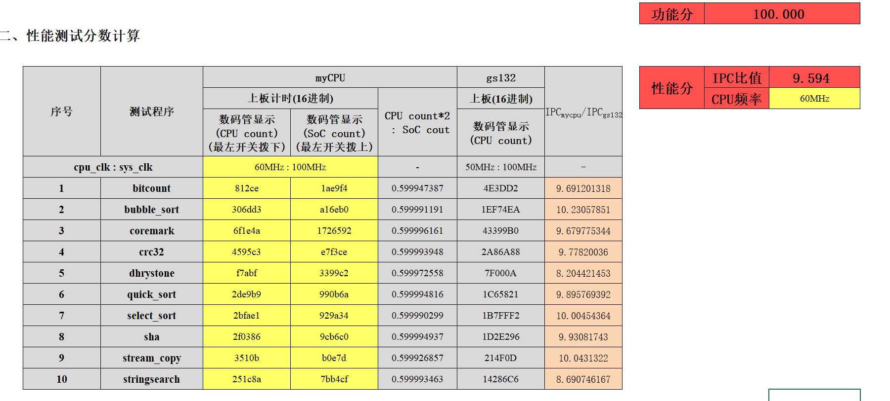

# NSCSCC MIPS 2023
## 性能分

### 2023/07/03

原始版本，参考[bitmips2019](https://github.com/Silverster98/bitmips2019)

### 2023/07/14

增加ICache
* IPC略有提升
* 寄存器资源消耗大幅减少！（使用bram的缘故）
### 2023/07/27

更新DCache
* IPC提升了一些
* 但是主频有下降
* 资源消耗大幅减少！（使用bram的缘故）

by 和植物抢氧气队